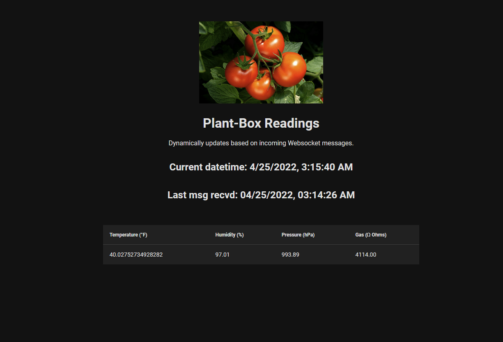

# plant-readings


## Description
A simple Vue/Python App that displays various growlab statistics from a Single-Board PC.

## Vue App Installation (package.json dir)
```
npm install
```

## To run
```
npm run serve 
```
&
```
python /server/plant-box_flask.py
```
